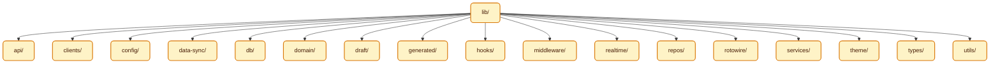

# Project Map — lib

```mermaid
flowchart TB
  classDef folder fill:#fef3c7,stroke:#d97706,stroke-width:2,color:#451a03,rx:8,ry:8
  classDef file fill:#f0fdf4,stroke:#65a30d,stroke-width:1.5,color:#422006,rx:4,ry:4
  R["lib/"]
  class R folder
  lib_api_["api/"]
  class lib_api_ folder
  R --> lib_api_
  click lib_api_ "/admin/project-map/lib/api" "Open api"
  lib_clients_["clients/"]
  class lib_clients_ folder
  R --> lib_clients_
  click lib_clients_ "/admin/project-map/lib/clients" "Open clients"
  lib_config_["config/"]
  class lib_config_ folder
  R --> lib_config_
  click lib_config_ "/admin/project-map/lib/config" "Open config"
  lib_data_sync_["data-sync/"]
  class lib_data_sync_ folder
  R --> lib_data_sync_
  click lib_data_sync_ "/admin/project-map/lib/data-sync" "Open data-sync"
  lib_db_["db/"]
  class lib_db_ folder
  R --> lib_db_
  click lib_db_ "/admin/project-map/lib/db" "Open db"
  lib_domain_["domain/"]
  class lib_domain_ folder
  R --> lib_domain_
  click lib_domain_ "/admin/project-map/lib/domain" "Open domain"
  lib_draft_["draft/"]
  class lib_draft_ folder
  R --> lib_draft_
  click lib_draft_ "/admin/project-map/lib/draft" "Open draft"
  lib_generated_["generated/"]
  class lib_generated_ folder
  R --> lib_generated_
  click lib_generated_ "/admin/project-map/lib/generated" "Open generated"
  lib_hooks_["hooks/"]
  class lib_hooks_ folder
  R --> lib_hooks_
  click lib_hooks_ "/admin/project-map/lib/hooks" "Open hooks"
  lib_middleware_["middleware/"]
  class lib_middleware_ folder
  R --> lib_middleware_
  click lib_middleware_ "/admin/project-map/lib/middleware" "Open middleware"
  lib_realtime_["realtime/"]
  class lib_realtime_ folder
  R --> lib_realtime_
  click lib_realtime_ "/admin/project-map/lib/realtime" "Open realtime"
  lib_repos_["repos/"]
  class lib_repos_ folder
  R --> lib_repos_
  click lib_repos_ "/admin/project-map/lib/repos" "Open repos"
  lib_rotowire_["rotowire/"]
  class lib_rotowire_ folder
  R --> lib_rotowire_
  click lib_rotowire_ "/admin/project-map/lib/rotowire" "Open rotowire"
  lib_services_["services/"]
  class lib_services_ folder
  R --> lib_services_
  click lib_services_ "/admin/project-map/lib/services" "Open services"
  lib_theme_["theme/"]
  class lib_theme_ folder
  R --> lib_theme_
  click lib_theme_ "/admin/project-map/lib/theme" "Open theme"
  lib_types_["types/"]
  class lib_types_ folder
  R --> lib_types_
  click lib_types_ "/admin/project-map/lib/types" "Open types"
  lib_utils_["utils/"]
  class lib_utils_ folder
  R --> lib_utils_
  click lib_utils_ "/admin/project-map/lib/utils" "Open utils"
```
