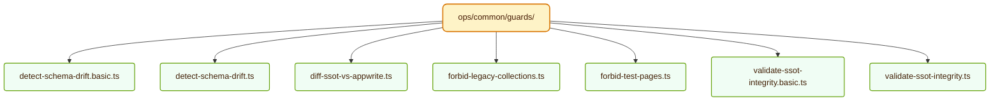

# Project Map — ops/common/guards

```mermaid
flowchart TB
  classDef folder fill:#fef3c7,stroke:#d97706,stroke-width:2,color:#451a03,rx:8,ry:8
  classDef file fill:#f0fdf4,stroke:#65a30d,stroke-width:1.5,color:#422006,rx:4,ry:4
  ops_common_guards["ops/common/guards/" ]
  class ops_common_guards folder
  ops_common_guards_detect_schema_drift_basic_ts["detect-schema-drift.basic.ts"]
  class ops_common_guards_detect_schema_drift_basic_ts file
  ops_common_guards --> ops_common_guards_detect_schema_drift_basic_ts
  ops_common_guards_detect_schema_drift_ts["detect-schema-drift.ts"]
  class ops_common_guards_detect_schema_drift_ts file
  ops_common_guards --> ops_common_guards_detect_schema_drift_ts
  ops_common_guards_diff_ssot_vs_appwrite_ts["diff-ssot-vs-appwrite.ts"]
  class ops_common_guards_diff_ssot_vs_appwrite_ts file
  ops_common_guards --> ops_common_guards_diff_ssot_vs_appwrite_ts
  ops_common_guards_forbid_legacy_collections_ts["forbid-legacy-collections.ts"]
  class ops_common_guards_forbid_legacy_collections_ts file
  ops_common_guards --> ops_common_guards_forbid_legacy_collections_ts
  ops_common_guards_forbid_test_pages_ts["forbid-test-pages.ts"]
  class ops_common_guards_forbid_test_pages_ts file
  ops_common_guards --> ops_common_guards_forbid_test_pages_ts
  ops_common_guards_validate_ssot_integrity_basic_ts["validate-ssot-integrity.basic.ts"]
  class ops_common_guards_validate_ssot_integrity_basic_ts file
  ops_common_guards --> ops_common_guards_validate_ssot_integrity_basic_ts
  ops_common_guards_validate_ssot_integrity_ts["validate-ssot-integrity.ts"]
  class ops_common_guards_validate_ssot_integrity_ts file
  ops_common_guards --> ops_common_guards_validate_ssot_integrity_ts
```
