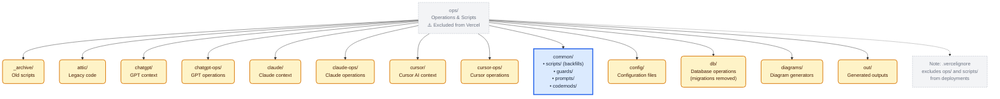

# Project Map — ops

```mermaid
flowchart TB
  classDef folder fill:#fef3c7,stroke:#d97706,stroke-width:2,color:#451a03,rx:8,ry:8
  classDef file fill:#f0fdf4,stroke:#65a30d,stroke-width:1.5,color:#422006,rx:4,ry:4
  classDef ignored fill:#f3f4f6,stroke:#9ca3af,stroke-width:1,stroke-dasharray:3 3,color:#6b7280
  classDef highlight fill:#dbeafe,stroke:#2563eb,stroke-width:3,color:#1e293b
  
  R["ops/<br/>Operations & Scripts<br/>⚠️ Excluded from Vercel"]
  class R ignored
  
  %% Archive folders
  ops__archive_["_archive/<br/>Old scripts"]
  class ops__archive_ folder
  R --> ops__archive_
  
  ops_attic_["attic/<br/>Legacy code"]
  class ops_attic_ folder
  R --> ops_attic_
  
  %% AI-specific folders
  ops_chatgpt_["chatgpt/<br/>GPT context"]
  class ops_chatgpt_ folder
  R --> ops_chatgpt_
  
  ops_chatgpt_ops_["chatgpt-ops/<br/>GPT operations"]
  class ops_chatgpt_ops_ folder
  R --> ops_chatgpt_ops_
  
  ops_claude_["claude/<br/>Claude context"]
  class ops_claude_ folder
  R --> ops_claude_
  
  ops_claude_ops_["claude-ops/<br/>Claude operations"]
  class ops_claude_ops_ folder
  R --> ops_claude_ops_
  
  ops_cursor_["cursor/<br/>Cursor AI context"]
  class ops_cursor_ folder
  R --> ops_cursor_
  
  ops_cursor_ops_["cursor-ops/<br/>Cursor operations"]
  class ops_cursor_ops_ folder
  R --> ops_cursor_ops_
  
  %% Active folders
  ops_common_["common/<br/>• scripts/ (backfills)<br/>• guards/<br/>• prompts/<br/>• codemods/"]
  class ops_common_ highlight
  R --> ops_common_
  click ops_common_ "/admin/project-map/ops/common" "Open common utilities"
  
  ops_config_["config/<br/>Configuration files"]
  class ops_config_ folder
  R --> ops_config_
  
  ops_db_["db/<br/>Database operations<br/>(migrations removed)"]
  class ops_db_ folder
  R --> ops_db_
  click ops_db_ "/admin/project-map/ops/db" "Open db operations"
  
  ops_diagrams_["diagrams/<br/>Diagram generators"]
  class ops_diagrams_ folder
  R --> ops_diagrams_
  
  ops_out_["out/<br/>Generated outputs"]
  class ops_out_ folder
  R --> ops_out_
  
  %% Note about .vercelignore
  vercelignore["Note: .vercelignore<br/>excludes ops/ and scripts/<br/>from deployments"]
  class vercelignore ignored
  R -.-> vercelignore
```
