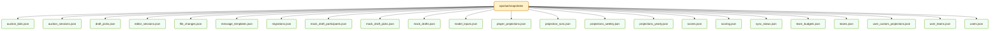

# Project Map — ops/out/snapshots

```mermaid
flowchart TB
  classDef folder fill:#fef3c7,stroke:#d97706,stroke-width:2,color:#451a03,rx:8,ry:8
  classDef file fill:#f0fdf4,stroke:#65a30d,stroke-width:1.5,color:#422006,rx:4,ry:4
  ops_out_snapshots["ops/out/snapshots/" ]
  class ops_out_snapshots folder
  ops_out_snapshots_auction_bids_json["auction_bids.json"]
  class ops_out_snapshots_auction_bids_json file
  ops_out_snapshots --> ops_out_snapshots_auction_bids_json
  ops_out_snapshots_auction_sessions_json["auction_sessions.json"]
  class ops_out_snapshots_auction_sessions_json file
  ops_out_snapshots --> ops_out_snapshots_auction_sessions_json
  ops_out_snapshots_draft_picks_json["draft_picks.json"]
  class ops_out_snapshots_draft_picks_json file
  ops_out_snapshots --> ops_out_snapshots_draft_picks_json
  ops_out_snapshots_editor_sessions_json["editor_sessions.json"]
  class ops_out_snapshots_editor_sessions_json file
  ops_out_snapshots --> ops_out_snapshots_editor_sessions_json
  ops_out_snapshots_file_changes_json["file_changes.json"]
  class ops_out_snapshots_file_changes_json file
  ops_out_snapshots --> ops_out_snapshots_file_changes_json
  ops_out_snapshots_message_templates_json["message_templates.json"]
  class ops_out_snapshots_message_templates_json file
  ops_out_snapshots --> ops_out_snapshots_message_templates_json
  ops_out_snapshots_migrations_json["migrations.json"]
  class ops_out_snapshots_migrations_json file
  ops_out_snapshots --> ops_out_snapshots_migrations_json
  ops_out_snapshots_mock_draft_participants_json["mock_draft_participants.json"]
  class ops_out_snapshots_mock_draft_participants_json file
  ops_out_snapshots --> ops_out_snapshots_mock_draft_participants_json
  ops_out_snapshots_mock_draft_picks_json["mock_draft_picks.json"]
  class ops_out_snapshots_mock_draft_picks_json file
  ops_out_snapshots --> ops_out_snapshots_mock_draft_picks_json
  ops_out_snapshots_mock_drafts_json["mock_drafts.json"]
  class ops_out_snapshots_mock_drafts_json file
  ops_out_snapshots --> ops_out_snapshots_mock_drafts_json
  ops_out_snapshots_model_inputs_json["model_inputs.json"]
  class ops_out_snapshots_model_inputs_json file
  ops_out_snapshots --> ops_out_snapshots_model_inputs_json
  ops_out_snapshots_player_projections_json["player_projections.json"]
  class ops_out_snapshots_player_projections_json file
  ops_out_snapshots --> ops_out_snapshots_player_projections_json
  ops_out_snapshots_projection_runs_json["projection_runs.json"]
  class ops_out_snapshots_projection_runs_json file
  ops_out_snapshots --> ops_out_snapshots_projection_runs_json
  ops_out_snapshots_projections_weekly_json["projections_weekly.json"]
  class ops_out_snapshots_projections_weekly_json file
  ops_out_snapshots --> ops_out_snapshots_projections_weekly_json
  ops_out_snapshots_projections_yearly_json["projections_yearly.json"]
  class ops_out_snapshots_projections_yearly_json file
  ops_out_snapshots --> ops_out_snapshots_projections_yearly_json
  ops_out_snapshots_scores_json["scores.json"]
  class ops_out_snapshots_scores_json file
  ops_out_snapshots --> ops_out_snapshots_scores_json
  ops_out_snapshots_scoring_json["scoring.json"]
  class ops_out_snapshots_scoring_json file
  ops_out_snapshots --> ops_out_snapshots_scoring_json
  ops_out_snapshots_sync_status_json["sync_status.json"]
  class ops_out_snapshots_sync_status_json file
  ops_out_snapshots --> ops_out_snapshots_sync_status_json
  ops_out_snapshots_team_budgets_json["team_budgets.json"]
  class ops_out_snapshots_team_budgets_json file
  ops_out_snapshots --> ops_out_snapshots_team_budgets_json
  ops_out_snapshots_teams_json["teams.json"]
  class ops_out_snapshots_teams_json file
  ops_out_snapshots --> ops_out_snapshots_teams_json
  ops_out_snapshots_user_custom_projections_json["user_custom_projections.json"]
  class ops_out_snapshots_user_custom_projections_json file
  ops_out_snapshots --> ops_out_snapshots_user_custom_projections_json
  ops_out_snapshots_user_teams_json["user_teams.json"]
  class ops_out_snapshots_user_teams_json file
  ops_out_snapshots --> ops_out_snapshots_user_teams_json
  ops_out_snapshots_users_json["users.json"]
  class ops_out_snapshots_users_json file
  ops_out_snapshots --> ops_out_snapshots_users_json
```
