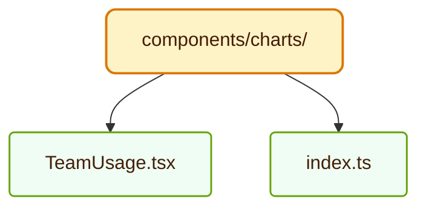

# Project Map — components/charts

```mermaid
flowchart TB
  classDef folder fill:#fef3c7,stroke:#d97706,stroke-width:2,color:#451a03,rx:8,ry:8
  classDef file fill:#f0fdf4,stroke:#65a30d,stroke-width:1.5,color:#422006,rx:4,ry:4
  components_charts["components/charts/" ]
  class components_charts folder
  components_charts_TeamUsage_tsx["TeamUsage.tsx"]
  class components_charts_TeamUsage_tsx file
  components_charts --> components_charts_TeamUsage_tsx
  components_charts_index_ts["index.ts"]
  class components_charts_index_ts file
  components_charts --> components_charts_index_ts
```
