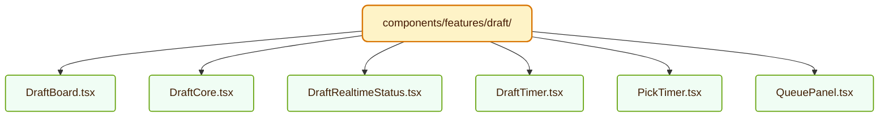

# Project Map — components/features/draft

```mermaid
flowchart TB
  classDef folder fill:#fef3c7,stroke:#d97706,stroke-width:2,color:#451a03,rx:8,ry:8
  classDef file fill:#f0fdf4,stroke:#65a30d,stroke-width:1.5,color:#422006,rx:4,ry:4
  components_features_draft["components/features/draft/" ]
  class components_features_draft folder
  components_features_draft_DraftBoard_tsx["DraftBoard.tsx"]
  class components_features_draft_DraftBoard_tsx file
  components_features_draft --> components_features_draft_DraftBoard_tsx
  components_features_draft_DraftCore_tsx["DraftCore.tsx"]
  class components_features_draft_DraftCore_tsx file
  components_features_draft --> components_features_draft_DraftCore_tsx
  components_features_draft_DraftRealtimeStatus_tsx["DraftRealtimeStatus.tsx"]
  class components_features_draft_DraftRealtimeStatus_tsx file
  components_features_draft --> components_features_draft_DraftRealtimeStatus_tsx
  components_features_draft_DraftTimer_tsx["DraftTimer.tsx"]
  class components_features_draft_DraftTimer_tsx file
  components_features_draft --> components_features_draft_DraftTimer_tsx
  components_features_draft_PickTimer_tsx["PickTimer.tsx"]
  class components_features_draft_PickTimer_tsx file
  components_features_draft --> components_features_draft_PickTimer_tsx
  components_features_draft_QueuePanel_tsx["QueuePanel.tsx"]
  class components_features_draft_QueuePanel_tsx file
  components_features_draft --> components_features_draft_QueuePanel_tsx
```
