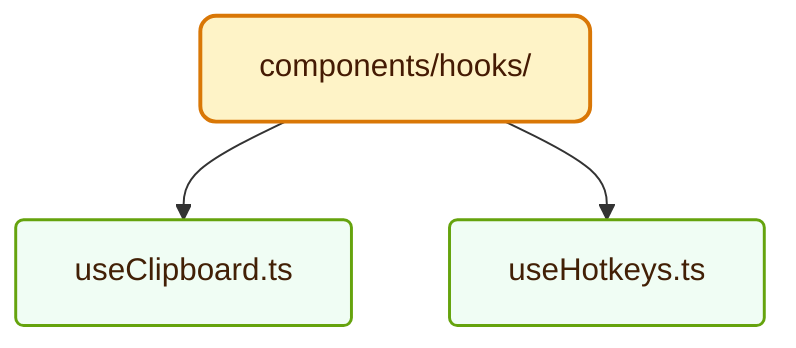

# Project Map — components/hooks

```mermaid
flowchart TB
  classDef folder fill:#fef3c7,stroke:#d97706,stroke-width:2,color:#451a03,rx:8,ry:8
  classDef file fill:#f0fdf4,stroke:#65a30d,stroke-width:1.5,color:#422006,rx:4,ry:4
  components_hooks["components/hooks/" ]
  class components_hooks folder
  components_hooks_useClipboard_ts["useClipboard.ts"]
  class components_hooks_useClipboard_ts file
  components_hooks --> components_hooks_useClipboard_ts
  components_hooks_useHotkeys_ts["useHotkeys.ts"]
  class components_hooks_useHotkeys_ts file
  components_hooks --> components_hooks_useHotkeys_ts
```
