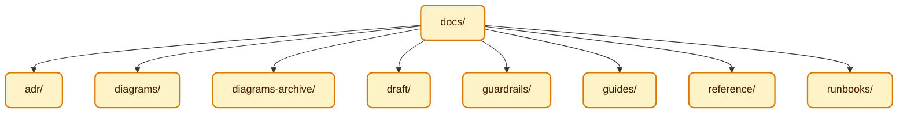

# Project Map — docs

```mermaid
flowchart TB
  classDef folder fill:#fef3c7,stroke:#d97706,stroke-width:2,color:#451a03,rx:8,ry:8
  classDef file fill:#f0fdf4,stroke:#65a30d,stroke-width:1.5,color:#422006,rx:4,ry:4
  R["docs/"]
  class R folder
  docs_adr_["adr/"]
  class docs_adr_ folder
  R --> docs_adr_
  click docs_adr_ "/admin/project-map/docs/adr" "Open adr"
  docs_diagrams_["diagrams/"]
  class docs_diagrams_ folder
  R --> docs_diagrams_
  click docs_diagrams_ "/admin/project-map/docs/diagrams" "Open diagrams"
  docs_diagrams_archive_["diagrams-archive/"]
  class docs_diagrams_archive_ folder
  R --> docs_diagrams_archive_
  click docs_diagrams_archive_ "/admin/project-map/docs/diagrams-archive" "Open diagrams-archive"
  docs_draft_["draft/"]
  class docs_draft_ folder
  R --> docs_draft_
  click docs_draft_ "/admin/project-map/docs/draft" "Open draft"
  docs_guardrails_["guardrails/"]
  class docs_guardrails_ folder
  R --> docs_guardrails_
  click docs_guardrails_ "/admin/project-map/docs/guardrails" "Open guardrails"
  docs_guides_["guides/"]
  class docs_guides_ folder
  R --> docs_guides_
  click docs_guides_ "/admin/project-map/docs/guides" "Open guides"
  docs_reference_["reference/"]
  class docs_reference_ folder
  R --> docs_reference_
  click docs_reference_ "/admin/project-map/docs/reference" "Open reference"
  docs_runbooks_["runbooks/"]
  class docs_runbooks_ folder
  R --> docs_runbooks_
  click docs_runbooks_ "/admin/project-map/docs/runbooks" "Open runbooks"
```
