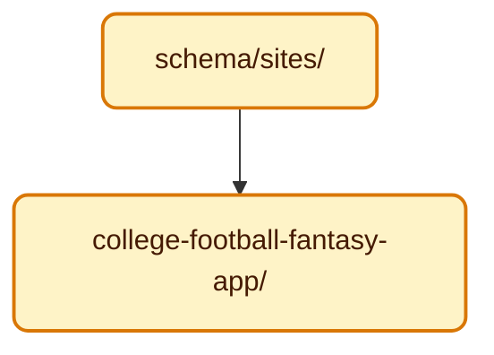

# Project Map — schema/sites

```mermaid
flowchart TB
  classDef folder fill:#fef3c7,stroke:#d97706,stroke-width:2,color:#451a03,rx:8,ry:8
  classDef file fill:#f0fdf4,stroke:#65a30d,stroke-width:1.5,color:#422006,rx:4,ry:4
  schema_sites["schema/sites/" ]
  class schema_sites folder
  schema_sites_college_football_fantasy_app["college-football-fantasy-app/"]
  class schema_sites_college_football_fantasy_app folder
  schema_sites --> schema_sites_college_football_fantasy_app
  click schema_sites_college_football_fantasy_app "/admin/project-map/schema/sites/college-football-fantasy-app" "Open college-football-fantasy-app"
```
