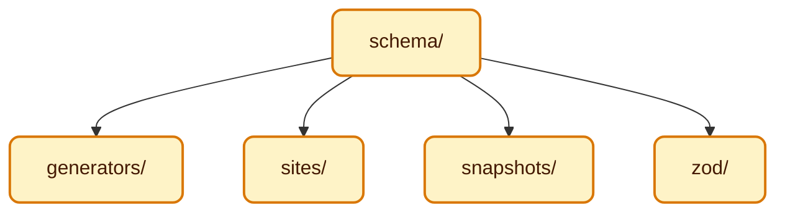

# Project Map — schema

```mermaid
flowchart TB
  classDef folder fill:#fef3c7,stroke:#d97706,stroke-width:2,color:#451a03,rx:8,ry:8
  classDef file fill:#f0fdf4,stroke:#65a30d,stroke-width:1.5,color:#422006,rx:4,ry:4
  R["schema/"]
  class R folder
  schema_generators_["generators/"]
  class schema_generators_ folder
  R --> schema_generators_
  click schema_generators_ "/admin/project-map/schema/generators" "Open generators"
  schema_sites_["sites/"]
  class schema_sites_ folder
  R --> schema_sites_
  click schema_sites_ "/admin/project-map/schema/sites" "Open sites"
  schema_snapshots_["snapshots/"]
  class schema_snapshots_ folder
  R --> schema_snapshots_
  click schema_snapshots_ "/admin/project-map/schema/snapshots" "Open snapshots"
  schema_zod_["zod/"]
  class schema_zod_ folder
  R --> schema_zod_
  click schema_zod_ "/admin/project-map/schema/zod" "Open zod"
```
