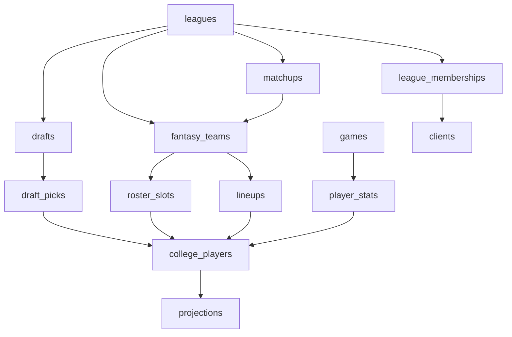

# Complete Schema Table

Generated: 2025-09-03
Total Collections: 29

## Collections Overview

| Collection            | ID                      | Attributes | Indexes | Doc Security | Purpose                     |
| --------------------- | ----------------------- | ---------- | ------- | ------------ | --------------------------- |
| activity_log          | `activity_log`          | 20         | 8       | No           | User activity tracking      |
| AP Rankings           | `rankings`              | 9          | 7       | No           | Weekly AP poll rankings     |
| Auctions              | `auctions`              | 6          | 3       | No           | Auction draft management    |
| Bids                  | `bids`                  | 11         | 3       | No           | Auction bid tracking        |
| clients               | `clients`               | 6          | 2       | No           | User authentication records |
| College Players       | `college_players`       | 16         | 7       | No           | Player roster data          |
| Database Migrations   | `migrations`            | 6          | 1       | No           | Schema version tracking     |
| Draft Picks           | `draft_picks`           | 20         | 3       | No           | Individual draft selections |
| Draft States          | `draft_states`          | 6          | 2       | Yes          | Real-time draft state       |
| draft_events          | `draft_events`          | 8          | 2       | No           | Draft event logging         |
| drafts                | `drafts`                | 22         | 2       | No           | Draft configuration         |
| fantasy_teams         | `fantasy_teams`         | 16         | 5       | No           | User fantasy teams          |
| Games                 | `games`                 | 16         | 5       | No           | NCAA game schedule          |
| invites               | `invites`               | 9          | 2       | No           | League invitations          |
| league_memberships    | `league_memberships`    | 7          | 3       | No           | User-league associations    |
| Leagues               | `leagues`               | 22         | 3       | No           | Fantasy league settings     |
| Lineups               | `lineups`               | 8          | 1       | No           | Weekly lineup submissions   |
| Mascot Download Tasks | `mascot_download_tasks` | 6          | 0       | No           | 3D mascot download queue    |
| Mascot Jobs           | `mascot_jobs`           | 11         | 0       | No           | 3D mascot generation jobs   |
| Mascot Presets        | `mascot_presets`        | 8          | 0       | No           | 3D mascot templates         |
| Matchups              | `matchups`              | 10         | 1       | No           | Weekly fantasy matchups     |
| meshy_jobs            | `meshy_jobs`            | 11         | 0       | No           | Meshy AI job tracking       |
| Model Versions        | `model_versions`        | 11         | 4       | No           | ML model versioning         |
| model_runs            | `model_runs`            | 13         | 1       | No           | ML model execution logs     |
| Player Stats          | `player_stats`          | 9          | 5       | No           | Game performance stats      |
| projections           | `projections`           | 21         | 1       | No           | Fantasy point projections   |
| roster_slots          | `roster_slots`          | 5          | 2       | No           | Team roster positions       |
| schools               | `schools`               | 8          | 2       | No           | College team information    |
| Transactions          | `transactions`          | 7          | 3       | No           | Roster moves/trades         |

## Key Collections Detail

### 1. `leagues` - Fantasy League Configuration

Core collection for league management with 22 attributes including:

- League settings (maxTeams, scoringType, draftType)
- Schedule configuration (seasonStartWeek, playoffStartWeek)
- Commissioner controls
- Privacy settings (isPublic, password)

### 2. `college_players` - Player Database

Complete Power 4 conference player roster:

- Player info (name, position, team, conference)
- Physical attributes (height, weight, jerseyNumber)
- Fantasy metrics (fantasy_points, depth_chart_order)
- Eligibility flags (draftable, eligible)

### 3. `draft_picks` - Draft History

Comprehensive draft pick tracking:

- Pick metadata (round, pick, overallPick)
- Player selection (playerId, playerName, playerPosition)
- Team association (fantasyTeamId, teamName)
- Timing (timestamp)

### 4. `fantasy_teams` - User Teams

User-created fantasy teams:

- Team identity (name, logo, motto)
- League association (leagueId)
- Performance metrics (wins, losses, points)
- Roster management (totalPlayers, rosterVersion)

### 5. `games` - NCAA Schedule

College football game schedule:

- Game details (week, season, homeTeam, awayTeam)
- Scores and status
- Eligibility flags for fantasy scoring
- TV/streaming information

## New Mascot Collections

### `mascot_jobs` (NEW)

3D mascot generation tracking:

- Job status and progress
- Generation parameters
- Output file references
- User associations

### `mascot_presets` (NEW)

Pre-configured mascot templates:

- Template configurations
- Default materials and poses
- Category classifications
- Usage permissions

### `mascot_download_tasks` (NEW)

Download queue management:

- Download status tracking
- File preparation
- User download limits
- Expiration handling

## Collection Relationships

## Index Strategy

### High-Performance Indexes

- `college_players`: 7 indexes on name, team, position, conference
- `activity_log`: 8 indexes for efficient activity queries
- `rankings`: 7 indexes for fast ranking lookups
- `games`: 5 indexes on week, teams, season

### Unique Constraints

- League names within same season
- User emails (in clients)
- Fantasy team names within league
- Draft pick positions within draft

## Security Configuration

### Document-Level Security

- `draft_states`: Enabled (real-time sensitive data)
- All others: Disabled (app-level security)

### Permission Model

- Read: Typically requires league membership
- Write: Restricted to owners/commissioners
- Delete: Admin-only for most collections

## Schema Versioning

- Current Version: 2025-09-03
- Collections: 29
- Last Migration: Added mascot collections
- Backwards Compatibility: Maintained via aliases
